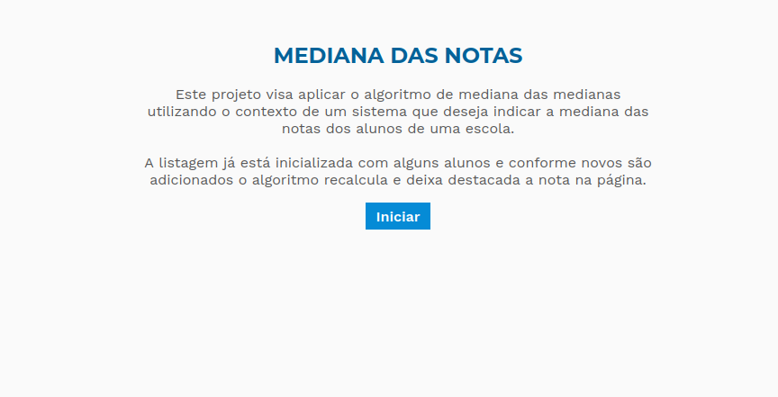
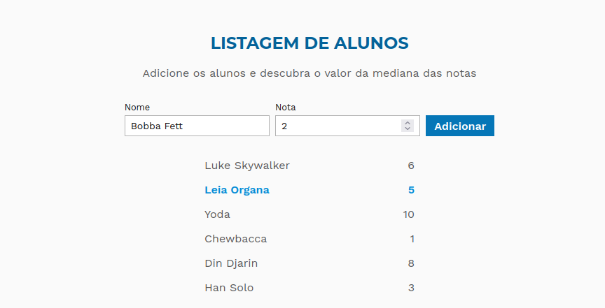

# Mediana das Notas

**Número da Lista**: 42 
**Conteúdo da Disciplina**: Dividir e Conquistar 

## Alunos
|Matrícula | Aluno |
| -- | -- |
| 17/0045269  |  Sara Campos |
| 18/0125974 | Lucas Rodrigues Monteiro |

## Sobre 
Este projeto visa aplicar o algoritmo de mediana das medianas utilizando o contexto de um sistema que deseja indicar a mediana das notas dos alunos de uma escola.

## Screenshots

## Instalação 
**Linguagem**: JavaScript 
**Framework**: ReactJS 
Para rodar o projeto é necessário inicialmente rodar os seguintes comandos: 

    cd mediana-das-notas
    npm install
    npm start

## Uso 
Após acessar o projeto no browser, o usuário irá encontrar uma página com uma breve descrição de onde será encaminhado para a página em que o algoritmo é executado. Nesta segunda página será possível adicionar alguns alunos e suas respectivas notas e observar em tempo real a nova mediana das notas sendo destacada. 

